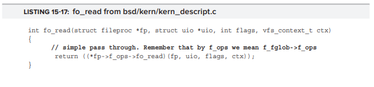

# < Chapter 15 : Fee, FI-FP, FIle : File Systems and the VFS >

커널의 주요 책임 중 하나는 사용자와 시스템 모두에서 데이터를 처리하는 것입니다. 이를 위해 데이터는 다양한 유형의 파일 시스템에 상주하는 파일과 디렉토리로 구성됩니다.

XNU의 BSD 계층은 파일 시스템 구현을 담당하며 VFS (Virtual File System Switch)라는 프레임 워크를 사용합니다. Sun의 Solaris 운영 체제에서 시작된이 프레임 워크는 커널과 다양한 파일 시스템 구현 (로컬 및 원격) 사이에서 UNIX에서 사용되는 표준 인터페이스가 되었습니다.

## PRELUDE: DISK DEVICES AND PARTITIONS / 전제조건 : 디스크 장치 및 파티션

OS X 및 iOS는 하드 디스크를 장치 노드로 취급하는 BSD 규칙을 따릅니다. 각 디스크는 블록 장치(/dev/disk#) 또는 문자 장치(/dev/rdisk#)로 액세스 할 수 있습니다. 마찬가지로, 파티션(또는 UNIX에서 "슬라이스")은 /dev/[r]disk#s# 와 비슷한 방식으로 블록과 문자로 액세스 할 수 있습니다.

일반적으로 디스크와 파티션은 블록 장치입니다. 시스템이 파일 시스템을 마운트 할 수 있는 것은 블록 장치 표현을 넘어선 것입니다. raw 모드는 주로 fsck 및 pdisk와 같은 저수준 프로그램에서 사용되며 블록을 직접 찾아 써야합니다.

디스크 드라이버는 또한 <sys/disk.h>에 정의 된 표준 ioctl 인터페이스를 제공하여 다양한 쿼리 작업을 수행 할 수 있습니다. 헤더는 꽤 잘 문서화되어 있으며 목록 15-1에 표시된 코드를 정의합니다.

ioctl()에 대한 디스크 장치를 확보하려면 읽기 권한이 필요하며 일반적으로 루트가 아닌 (또는 그룹이 아닌 운영자) 사용자에게는 부여되지 않습니다.

## Partitioning Schemes / 파티션 스키마
파일 시스템은 자체적으로 존재하지 않습니다. 이들은 디스크의 파티션에 상주합니다. 모든 디스크에는 하나 이상의 파티션이 있으며 파일 시스템을 포함하도록 파티션을 개별적으로 포맷 할 수 있습니다. 경우에 따라 파일 시스템이 여러 파티션에 걸쳐있을 수 있습니다. 파티셔닝 스키마는 디스크 레이아웃을 정의하여 디스크를 연속적인 섹터의 하나 이상의 영역 (따라서 파티션)으로 논리적으로 분할합니다. 일반적으로 여기에는 파티션 테이블에 대한 디스크의 처음 몇 개의 섹터를 예약하는 작업이 포함되며 여기에는 영역 (시작 섹터 및 섹터 수)과 각 파티션의 파일 시스템 유형이 나열됩니다.

OS X은 전통적으로 세 가지 파티션 구성표를 지원했습니다 : 

	- Master Boot Record (MBR) partitioning : MBR은 PC XT와 AT의 옛 시절의 유산이며 오늘날에도 여전히 널리 사용되고 있습니다. 이 파티션 스키마는 BIOS에 의존하며 매우 제한적이며 (최대 4개의 파티션) 32 비트(최대 40억 섹터)이지만 모든 운영 체제에서 보드 전체에서 지원됩니다.

	- Apple Partition Map : 맞춤형 Apple 전용 체계. PPC기반 Mac이 널리 퍼져 있으며, 32비트의 스키마이고 애플 독점입니다. 지금은 다음의 방식 GPT에 찬성하여 더 이상 사용되지 않지만, 여전히 아이팟 클래식과 나노에서 사용되고 있습니다.

	- GUID Partition Table (GPT) : 엑사 바이트 범위 이상으로 디스크 크기에 사용될 수 있는 64 비트 스키마. 또한 최대 파티션 제한을 효과적으로 완화합니다. 이것은 특히 중요합니다. 32 비트 방식인 MBR과 APT는 모두 최대 주소 지정이 가능한 232 섹터를 허용합니다. 표준 섹터 크기가 512 바이트 인 경우 최대 2TB의 디스크 크기가 허용됩니다. 따라서 애플의 기본 파티셔닝 스키마는 64 비트 아키텍처로 옮겨졌습니다. GPT는 EFI 표준의 일부이기도합니다. Apple의 Intel 하드웨어가 EFI 기반이기 때문에 제대로 작동합니다.

	그러나 일부 32 비트 시스템 (주로 Windows XP)은 여전히 GPT를 지원할 수 없습니다. EFI인 Intel의 OS X는 기본적으로 지원합니다. 10.4 현재, Apple 기술 노트에 설명 된대로, GPT는 기본 파티션 스키마로 Apple에서 선호하고 있습니다.

	- Lightweight Volume Manager (LwVM) : iOS 5 이상 (및 일부 구형 Apple TV)에서 사용되는 Apple 독점 파티션 체계. 독점적이고 문서화되지 않았지만 상당히 단순하고 리버스 엔지니어링되었습니다.
	
커널 확장은 IOKit의 IOPartitionScheme 클래스 (그 자체가 포함 된 IOStorage의 하위 클래스)에서 상속하여 추가 또는 사용자 정의 파티션 스키마를 구현할 수 있습니다.

## The MBR Partitioning Scheme / MBR 파티셔닝 스키마

16비트의 마지막 유물인 마스터 부트 레코드 스키마는 빠르게 사라지고 있지만 OSX 및 64비트 Windows를 저장하는 다른 모든 운영 체제에서 기본 파티션 스키마로 남아 있습니다. 의심 할 여지없이 가장 간단한 파티셔닝 스키마입니다. BIOS는 시스템을 시작하는데 사용하는 최대 440 바이트의 부트 스트랩 코드를 위해 디스크의 첫 번째 섹터인 부트 섹터를 예약합니다. 440바이트는 일반적으로 offset 446에 있는 파티션 테이블을 읽고 운영체제 별로 c 코드가 있는 파티션의 시작 부분인 파티션 부트 레코드로 이동합니다. 파티션 테이블의 크기는 64 바이트입니다. 이렇게 하면 MBR signature인 0x55AA로 고정된 2개의 사용 가능한 바이트만 남게 됩니다.

MBR 테이블은 매우 단순하게 유지됩니다. 항상 64바이트이기 때문에 "기본" 파티션 항목을 4개까지만 허용합니다. 각 항목의 길이는 정확히 16바이트이며 파티션 유형, 크기 및 주소를 설명합니다. 표의 항목은 파티션 시작 및 끝 주소를 실린더/헤드/섹터(C/H/S) 좌표 또는 일반적으로 큰 블록 주소(LBA) offset의 두 가지 형식 중 하나로 제공합니다. C/H/S 체계는 오늘날의 표준에 따라 상당히 작은 드라이브로 제한되기 때문에 후자가 더 자주 사용됩니다.

휴대용 하드 드라이브가 있는 경우 MBR형식일 가능성이 있으며 원시(raw) 디스크 장치의 터미널에서 다음을 시도 할 수 있습니다 (읽기 액세스를 위해서는 루트 여야합니다). 그렇지 않은 경우 출력 15-1에 표시된 것처럼 OS X hdiutil을 사용하여 MBR 기반 이미지를 만들 수 있습니다. 디스크 이미지 또는 .dmg 파일은 이 장의 뒷부분에서 설명합니다.

우리가 만든 이미지를 부팅 할 수 없기 때문에 처음 440(0x1b8) 바이트는 모두 0입니다. 다음은 선택적인 32비트 디스크 서명(이 경우에는 없음)과 예약된 2 바이트입니다. 0x1be의 비정상적인 offset에는 파티션 테이블이 있습니다. 이는 32 비트 경계가 아닌 16에 정렬되어 있기 때문입니다. 각 항목은 16 바이트이며 앞의 예에서는 하나만 있습니다. 

이전 output과 아래의 그림 15-4의 레코드 형식을 살펴보면, 파티션이 부팅 불가능한 HFS+ 파티션(0xAF)이며 LBA 블록 1에서 시작하여 131,071블록(64MB)에 걸쳐 있다는 결론에 빨리 도달해야 합니다.

제공된 간단한 예에서 MBR이 종료되는 이유가 분명합니다. 32 비트로 최적화되지 않았으며 4 개의 기본 파티션으로 제한되며 C / H / S 추출은 간단하지 않으며 (여러 비트 시프트 필요) 주소 지정 및 1023 개의 실린더, 63 개의 헤드 및 254 개의 섹터로 제한됩니다. 지금까지 MBR의 생존을 허용하는 유일한 방법은 LBA가 최대 2TB를 처리 할 수 있으므로 C/H/S가 아닌 LBA (Large Block Access) 블록 주소를 사용하는 것입니다. 공간은 날이 더욱 풍성해집니다. 애플은 이러한 한계와 다른 한계를 상당히 일찍 극복했기 때문에 자체 파티션 스키마인 애플 파티션 스키마를 채택했습니다.

## The Apple Partitioning Scheme

APM (Apple Partitioning Scheme)은 MBR의 대안으로 Apple에서 설계 한 것으로, 4개의 기본 파티션의 한계를 해결하고 LBA를 허용합니다. 요즘은 PPC 기반 Mac이나 iPod Classic 또는 Nano가 없는 한 Apple Partitioning Scheme으로 포맷된 디스크는 일반적으로 덜 접하게 됩니다. 그러나 여기서도 OS X의 hdiutil 도구를 사용하여 APM 형식의 DMG 파일을 만들 수 있습니다. 그런 다음 출력 15-2에 표시된 명령을 사용하여 장치를 따라갈 수 있습니다.

이 예제에서는 처음에 파티션이 하나인 256MB 디스크 이미지를 만든 다음 각각 별도의 파일 시스템 유형을 포함하는 3개로 다시 분할했습니다. 파티션 맵 자체는 파티션을 사용하기 때문에 (앞의 예에서/dev/disk4s1), 사용 가능한 파티션은 /dev/disk4s2에서 /dev/disk4s4까지 4개의 파티션으로 끝납니다. 기술적으로 APM에는 디스크의 모든 블록을 파티션으로 덮어야하기 때문에 여유 공간을 확보하기위한 파티션이 하나 더 있습니다. 그러나 여유 공간은 장치 노드로 액세스 할 수 없습니다 (즉, 앞의 예에는 /dev/disk4s5가 없습니다).

디스크 수준에서 APM은 디스크의 첫 번째 블록인 블록 0을 특수 드라이버 descriptor 맵에 예약합니다. <IOStorage / IOApplePartitionScheme.h>에 정의된 블록 0은 고정된 ER signature(0x4552)로 식별할 수 있습니다. 블록은 512 블록 바이트 중 82만 차지하는 구조로 대부분 사용되지 않습니다. 일반적으로 그림 15-6에서 볼 수 있듯이 대부분의 구조 필드는 0으로 유지되며 서명, 블록 크기 및 블록 수는 두 가지 중요합니다.

앞의 예제에서 볼 수 있듯이, 우리의 디스크 블록 크기는 512바이트(0x0200)이며, 디스크에는 표시에 바로 있는 524,288개(0x80000) 블록이 포함되어 있으며, 총 256MB이다.

파티션 맵은 첫 번째 블록에서 찾을 수 있습니다 (512 바이트 블록 크기의 경우 0x200 offset). 각 항목은 하나의 블록을 차지합니다. 맵 자체에 대한 항목 하나와 사용 가능한 공간(Apple_Free)에 대한 항목 하나를 세면, 사용 가능한 파티션보다 항상 두 개의 항목이 더 있을 것 입니다. 예를 들어, 본 예제에서 세 개에 대해 다섯 개의 항목이 있을 것 입니다.

## The GPT Partitioning Scheme

The Globally Unique Identifier Partition Table (GUID PT, or GPT, for short)는 Extensible Firmware Interface 사양의 일부로 개발되었습니다. Apple이 Intel 기반 아키텍처로 전환했을 때 더 큰 디스크를 위해 APM을 수정하는 대신 GPT를 채택하는 것이 합리적이었습니다. 실제로, Apple의 기술 노트 TN2166은 APM을 효과적으로 사용하지 않아서 2TB가 표준이 되는 디스크를 상상할 수 있다고합니다. GPT는 여전히 시대에 앞서 있지만 OS X 및 iOS에서 모두 사용됩니다.

GPT는 Extensible Firmware Interface 표준의 일부로 완전히 지정되어 있습니다. EFI는 6 장에서 이미 자세히 설명했습니다. EFI의 전체 사양은 GPT에 대한 포괄적 인 세부 정보도 제공합니다. 시스템 관리 명령 gpt는 GPT 테이블을 조작하는 데 사용할 수 있다(파티션의 추가/제거/라벨에만 사용되며 크기를 조정하지 않는다). (그림 15-8 참조)

MBR과의 역 호환성을 제공하기 위해 GPT 포맷 디스크의 첫 번째 섹터 (LBA 0)에는 "보호 MBR"이 포함되어 있습니다. 레거시 운영체제에 대한 이 정의는 전체 디스크를 알 수 없는 파티션(0xEE)으로 정의하여 unformatted 디스크로 잘 못 분류되지 않도록 합니다. 

실제 GPT는 두 번째 섹터 (LBA 1)에 있습니다. 이 섹터에는 GPT 헤더가 포함되어 있으며 GPT 매직 문자열 EFI PART (0x45 0x46 0x49 0x20 0x50 0x41 0x52 0x54)로 시작하고 파티션 맵 세부 정보를 포함합니다. 헤더 다음에는 단순히 파티션 배열인 파티션 맵이 있습니다. 이러한 구조는 IOKit 프레임 워크의 storage / IOGUIDPartitionScheme.h에 정의되어 있습니다 (목록 15-9 참조).

GPT 파티션의 이름을 지정 (또는“labeled”) 할 수 있으므로 부팅 파티션을 정의 할 때 유연성이 향상됩니다. 이렇게하면 파티션을 다시 정렬하거나 디스크를 추가/제거하여 부팅 할 수 없는 시스템 시나리오를 피할 수 있습니다.

## Lightweight Volume Manager

LwVM (Lightweight Volume Manager)은 Apple 고유의 파티션 스키마이며 iOS 5에서 기본값으로 GPT를 상속했습니다. 개념적으로 GPT와 다소 유사하지만 파티션 암호화도 허용합니다.

독점(Proprietary) 형식은 OpeniBoot 개발자가 리버스 엔지니어링 한 것으로 Listing 15-10과 다소 비슷합니다.

알려진 유일한 속성은 암호화되어 파티션이 암호화되어 커널에 의해 해독되어야 함을 지정합니다.
예를 들어, 2 개의 파티션이 있는 64GB 장치(작성자의 iPod Touch 64GB)의 iOS 5 시스템에서 출력 15-11의 od 출력을 고려하십시오.

LwVM은 iOS의 모든 kext와 마찬가지로 커널에 사전 연결되어있는 전용 커널 확장 인 LightweightVolumeManager.kext (com .apple.driver.LightweightVolumeManager)에 의해 iOS에서 처리됩니다.

## CoreStorage

CoreStorage는 Lion에 도입 된 새로운 파티션 유형으로, OS X에 필요한 논리적 볼륨 관리 지원을 제공합니다. CoreStorage 파티션은 동적으로 확장하거나 축소 할 수있는 논리 볼륨으로 여러 파티션에 걸쳐있을 수 있습니다. CoreStorage는 또한 전체 디스크 암호화 (일반적으로 FDE라고 함)를 활성화하며 FileVault 2의 기능을 사용하려면 필요합니다. CoreStorage 볼륨은 GPT 드라이브에서만 만들 수 있으며 HFS + 파티션은 저널링해야합니다.

현재 CoreStorage 볼륨 형식은 Lion에서 지원되지만 문서화되어 있지 않습니다. 새로운 "corestorage" 하위 명령이 있는 diskutil을 사용하여 파티션을 만들 수 있습니다. 여기서 그림 15-12에 표시된 명령을 사용할 수 있습니다.

encryptVolume 및 decryptVolume은 Mountain Lion의 새로운 기능입니다. deleteVolume 명령은 문서화되지 않았지만 Lion에 있었습니다. 또한 addDisk, resizeDisk, resizeVolume, resizeStack 및 removeDisk는 의심할 여지없이 매우 유용하지만 둘 다 문서화되지 않은 상태로 남아 있습니다. 그러나 시도하면 사용법에 대한 도움말이 표시됩니다.

볼륨의 CoreStorage로의 변환은 암호화가 되지 않는 한 되돌릴 수 있다(그리고 되돌릴 수 있는 동사를 사용하여 해제될 수도 있다).

diskutil 외에도 fsck_cs 명령이 Lion에서 제공되어 CoreStorage 파티션을 확인하고 복구합니다. 실제 파티션 처리 로직은 CoreStorageFsck 플러그인 kext가 추가 된 커널 확장 CoreStorage.kext (com.apple.driver.CoreStorage라고도 함)에 의해 제공됩니다.

CoreStorage 디스크에서 gpt 명령을 사용하면 파티션 구조를 표시 할 수 있습니다. 그림 15-13은 CoreStorage 포맷 디스크에서이 명령의 결과를 보여줍니다 (CoreStorage를 지원하지 않는 Snow Leopard에서).

기본 장치를 통해 파티션을 직접 검사하면 CoreStorage와 관련된 구조가 나타납니다 :

 - CoreStorage와 관련된 GPT GUID는 53746F72-6167-11AA-AA11-00306543ECAC입니다. od –x의 렌즈를 통해 볼 때 이것은 6f72 5374 6167 11aa 11aa 3000 4365 acec로 나타납니다.
 
 - CoreStorage 볼륨 GUID도 CoreStorage 파티션 헤더에 나타납니다. 논리 볼륨 및 볼륨 그룹의 GUID는 각각 offset 304 및 320에 있습니다.
 
 - CoreStorage 파티션은 실제로 HFS+ 파일 시스템 구현입니다. 그러나 직접 마운트 할 수 없으며 대부분 Spotlight에서 사용하기 위한 파일이 포함되어 있습니다. HFS+ 파일 시스템 구조의 디버깅 및 표시에 특히 적합한이 책의 웹 사이트에있는 hfsleuth 도구를 사용하여 CoreStorage 파티션을 표시 할 수도 있습니다.
 
리버스 엔지니어링 CoreStorage는 OS X 외부로 확장하기 위한 지속적인 프로젝트입니다. 최신 상태 및 정보는 이 책의 웹 사이트를 확인하십시오.

## GENERIC FILE SYSTEM CONCEPTS

파일 시스템마다 디스크에서 파일을 관리하는 방법이 완전히 다르지만 일반적으로 모두 동일한 기본 형식으로 작동합니다. VFS(Virtual FileSystem Switch)라고 하는 파일에 대한 커널 인터페이스는 이러한 개념을 기반으로 구축된다.

## Files

파일 시스템에서 가장 기본적인 개념이 파일 자체의 개념이라는 것은 놀라운 일이 아닙니다. 파일 시스템의 관점에서 볼 때 파일은 기본 미디어 (디스크, CD-ROM 또는 기타)에있는 하나 이상의 블록 배열입니다. 최적의 경우, 파일은 하나의 연속 된 블록 시퀀스입니다. 그러나 파일은 여러 블록 범위에 걸쳐 있습니다. 이를 일반적으로 extents라고합니다. HFS+는 파일이 할당되거나 확장 될 때 파일에 제공되는 기본 할당 블록인 덩어리(clumps)를 정의합니다.

조각화에 관계없이 파일 시스템은 파일 모양을 연속적이고 자유롭게 찾을 수 있는(랜덤 액세스) 영역으로 표시해야합니다. 요청자는 기본 구현에 대해 아무것도 알 필요가 없습니다. 실제로 일부 파일 시스템은 완전히 가상 (예 : Linux / proc) 인 반면 다른 파일 시스템은 네트워크 (NFS 또는 AFS 등)를 통해 매핑 될 수 있습니다. 따라서 요청자는 오직 하나의 파일 디스크립터(open에서 리턴 된 int fd 또는 fopen에서 리턴 된 FILE*)만 포함하지만 이를 불분명한 핸들로 취급합니다. 커널은 파일 요청을 처리 할 때 핸들을 파일 시스템의 식별자로 변환합니다.

## Extended Attributes

XNU의 VFS는 일반적인 파일 속성 외에도 확장 된 속성 개념을 지원합니다. 이러한 속성은 사용자(또는 시스템) 정의 속성이며, 애플리케이션에서 사용하는 정보 또는 많은 경우 시스템 자체를 포함할 수 있다. Darwin에서는 확장 속성을 사용하여 투명한 압축 및 포크 (다음 장에서 설명) 및 액세스 제어 목록 (다음에 설명)과 같은 고급 기능을 지원합니다.

## Permissions

모든 파일이 동일하게 생성되는 것은 아닙니다. 일부 파일에는 잠재적으로 민감한 정보가 포함되어 있으며 모든 자체 respecting 파일 시스템 (FAT 제품군 제외)은 권한을 지원해야 합니다. Mac의 기본 HFS+ 중 하나인 UNIX 파일 시스템은 기존 사용자/그룹/기타 읽기/쓰기/실행 모델을 지원합니다. 이 모델은 단일 사용자 및 단일 그룹에 대한 권한만 설정하여 다른 모든 사용자를 "other" 범주로 캐스트 할 수 있으므로 매우 원시적인(primitive) 모델입니다.

그러나 OS X 10.4부터 VFS는 잘 알려진 NTFS 권한과 유사하지만 POSIX 1.3 보안 표준을 준수하는 세분화된 권한에 대한 지원을 추가합니다. 이를 일반적으로 엑세스 제어 목록 또는 ACL이라고 합니다. OS X에서는 chmod를 사용하여 ACL을 설정하고 수정할 수 있습니다. ls -e를 사용하여 액세스 제어 목록을 표시 할 수 있습니다. ACL이 있는 파일은 더하기(+) 기호와 함께 ls -l의 출력에 나타납니다. VFS는 ACL을 지원하기 위해 확장된 속성을 사용하며 KAUTH (bsd/kern/kern_authorization.c)라는 별도의 메커니즘으로 적용됩니다.

## Timestamps

파일 시스템은 포함된 다양한 파일에 대한 타임 스탬프를 기록해야합니다. UNIX는 생성, 수정 및 액세스라는 세 가지 타임 스탬프를 유지해야합니다. 이는 touch(1) 명령에서 익숙한 -acm 스위치로, –u(액세스), -U(creation) 또는 둘 다(modify)를 사용할 때 ls(1)로 표시할 수 있다.

## Shortcuts and Links

대부분의 UNIX 사용자는 소프트("심볼릭"이라고도 함) 및 하드 링크에 대해 잘 알고 있습니다. 소프트 링크는 ln –s로 작성되는 반면 하드 sibling은 스위치 없이 작성됩니다. VFS의 관점에서 소프트 링크는 l 유형의 다른 파일(즉, 다른 inode)이며, 가리키는 파일의 이름을 포함하고 있습니다. 반면, 하드 링크는 동일한 기본 파일(또는 VFS의 관점에서 볼 수 있듯이 동일한 inode)을 가리키는 또 다른 디렉토리 항목이다. 그것을 보는 또 다른 방법은 하드 링크가 디렉토리 레벨에 존재하는 반면 소프트 링크는 파일 레벨에 존재한다는 것입니다.(그림 15-14 참고)

하드 링크는 소프트 링크와 마찬가지로 파일 바로 가기를 설정하는 메커니즘을 제공합니다. 그러나 소프트 링크와 달리 하드 링크는 파일에 대한 마지막 링크가 제거 된 경우에만 파일 시스템에서 파일이 제거되므로 실수로 파일을 삭제하지 못하게합니다. 표 15-15은 링크 유형 간의 차이점을 보여줍니다.

심볼릭 링크와 하드 링크에 대한 자세한 내용은 symlink (7) 매뉴얼 페이지를 참조하십시오.

## File System in the Apple EcoSystem

OS X와 iOS는 모두 무수한 파일 시스템을 지원합니다. 본질적으로, 커널의 모듈화 덕분에, VFS의 표준 커널을 모두 준수하는 한, 다수의 파일 시스템이 지원될 수 있습니다. 이 섹션에서는 이러한 파일 시스템 유형에 대해 자세히 설명합니다.

달리 명시되지 않는한, 파일 시스템은 mount_xxx 명령 (xxx는 파일 시스템 이름)로 로드 될 수 있습니다. 실제 파일 시스템 지원은 커널 확장자(보통 xxxfs.kext로 /System/Library/Extensions에서 제공)에 의해 제공됩니다. 추가 디렉토리인 /System/Library/Filesystems 에는 파일 시스템 유지 관리를 위해 해당 “util” 바이너리가 제공되는 특정 파일 시스템에 대한 하위 디렉토리가 있습니다.

## Native Apple File System

Apple은 전통적으로 Mac의 초기 시절부터 자체 파일 시스템을 사용했습니다. 이러한 파일 시스템에 대한 지원은 여전히 OS X에 있습니다.

### Hierarchical File System(HFS)

HFS (Hierarchical File System)는 Apple이 OS X의 시대 이전의 Mac OS 초기에 사용하기 위해 개발 한 기본 파일 시스템 구조입니다. 요즘에는 다음과 같이 HFS+로 대체되어 더 이상 사용되지 않는 파일 시스템입니다.

### Hierarchical File System Plus(HFS+)

디스크 스토리지가 기하 급수적으로 증가함에 따라 HFS는 매우 제한된 파일 시스템으로 판명되었습니다. 애플은 이러한 한계를 극복하고 더 나은 완전한 32 비트 및 64 비트 기능을 제공 할 수있는 확장 기능을 개발할 것을 요구했습니다. 이러한 개선의 결과는 HFS+(Hierarchical File System Plus)입니다.

HFS +는 Apple 제품의 기본 파일 시스템이었으며 지금도 여전히 사용 중입니다. iPod Nano에서부터 iPad 및 Mac까지 HFS+(또는 대소 문자 구분 변형 인 HFSX)가 널리 사용됩니다. 이 책은 보편적인 내용을 다루고 있으므로 다음장에서 내부 작업에 대해서 설명하겠습니다.

애플의 제품 이외의 HFS+의 채택은 사실상 존재하지 않습니다. Linux 및 Windows (저자에 의해 작성되었지만 폐쇄 소스로 남아있는 것을 포함하여)를 위한 다양한 HFS+ 구현이 있지만 전체적으로 파일 시스템의 채택은 매우 제한적입니다.

HFS+와 그 변형 HFSX는 모두 커널의 일부로 OS X에서 기본적으로 지원됩니다. 구현은 XNU의 bsd/hfs 디렉토리에 있습니다.

## Dos/Windows File System

Apple 이외의 세상은 항상 Microsoft에 의해 지배되어 왔으며 파일 시스템도 마찬가지로 사실상 표준입니다. 애플은 맥에서 이러한 시스템을 지원할 수 밖에 없었고 현재까지도 지원하고 있습니다.

### File Allocation Table(FAT)

FAT(File Allocation Table)는 사용중인 가장 단순하고 오래된 파일 시스템 중 하나입니다. 소량의 비교적 낮은 오버헤드 때문에 플로피 디스크 시대에 선택했던 파일 시스템이었고, 간단한 구현으로 인해 SD 카드와 대부분의 USB 플래시 드라이브와 같은 모바일 미디어에서 여전히 널리 사용되고 있다.

FAT의 가장 잘 알려진 특징은 파일 이름이 8 자로 제한되고 선택적인 확장명 (최대 3 자)으로 짧은 파일 이름 ( "8.3"으로 알려짐)입니다. 기본 FAT의 또 다른 한계는 2GB로 제한되어 있으며 확장하더라도 오늘날의 표준에 따라 4GB 용량을 초과 할 수 없다는 것입니다.

수년 동안 FAT의 수석 개발자인 Microsoft는 이전 버전과의 호환성 문제로 인해 혼란에 빠졌습니다. 이로 인해 FAT가 다양한 변형으로 수정되었습니다. 원래 FAT-12 (1980 년대 640k 시대에 사용하기에 적합한 12 비트 파일 시스템)에서부터 FAT-16 또는 대부분의 DOS에서 기본 파일 시스템이었던 간단한 "FAT"이 있습니다. Windows 95는 VFAT (긴 파일 이름을 수용하기 위해)와 FAT-32 (약 2-4GB 볼륨 크기를 극복하고 막대를 2TB로 올림)를 가져왔습니다.

지금까지 설명한 모든 기본 변형에서 FAT는 msdosfs 커널 확장을 통해 OS X에서 지원됩니다.

가장 널리 사용되는 FAT 유형 인 FAT-32는 여전히 2TB 볼륨으로 제한되어 있으며 현재 더 큰 하드 드라이브를 사용할 수 있으므로 이론적으로 64 제타 바이트로 제한되는 새로운 시스템 인 ExFAT를 위해 단계적으로 폐지되고 있습니다. 1 ZetaByte는 270 바이트 (또는 1 기가 바이트)이므로 ExFAT는 한동안 지속됩니다. ExFAT는 플래시 미디어의 한계를 고려하여 플래시 드라이브 용으로 특별히 설계되었습니다.

Mac OS X은 exfat 커널 확장 및 mount_exfat (8) 명령과 함께 Snow Leopard 및 Lion의 이후 릴리스에서 ExFAT를 지원합니다.

### NT File System(NTFS)

Windows NT는 Microsoft의 첫 번째 다중 사용자 운영 체제였으며 FAT (당시 16 비트 구현)는 그 요구에 부적합한 것으로 판명되었습니다. FAT에서 빠진 주요 기능은 권한과 할당량이었습니다. 파일에 대한 임의 액세스 제어를 허용하려면 권한이 필요했습니다. 할당량(Quotas)은 사용자가 공유 파일 시스템을 악용하고 너무 많은 파일을 채우는 것(clutter)을 제한하는 메커니즘입니다. Microsoft는 두 가지 목적을 모두 충족시키기 위해 Windows 2000부터 모든 운영 체제에서 기본 파일 시스템이 된 NT 파일 시스템을 도입했습니다.

Apple은 NTFS용 드라이버인 ntfs.kext를 제공하지만 읽기 전용 작업만 지원합니다. NTFS용 상용 드라이버와 프리웨어 드라이버가 모두 존재하므로 필요한 전체 읽기/쓰기 기능이 필요합니다.

## CD/DVD File

CD 및 DVD는 매체 유형 및 사용법에 따라 고유 한 독점 파일 시스템을 사용했습니다.

### The CD/Audio File System(CDDAFS)

오디오 CD는 CD-ROM처럼 장착 할 수 있습니다. 오디오 트랙 자체는 AIFF 형식의 파일로 나타납니다. AIFF 파일의 “cat”은 raw CD 데이터를 제공합니다.(iTunes가 CD 트랙을 해당 라이브러리로 추출하거나 가져 오는 방법)

iTunes 데이터베이스를 참조 할 수있는 경우 파일은 실제로 해당 오디오 트랙과 이름이 같으며 볼륨의 이름은 CD와 같습니다. 그렇지 않으면 일반 "오디오 CD"가 볼륨 이름에 사용되고 "#오디오 트랙"이 트랙에 사용됩니다 (#은 트랙 번호임). 트랙 이름 확인은 예상대로 사용자 모드에서 수행되며 이름은 인수로 mount_cddafs 유틸리티에 전달됩니다. 

마운트된 CD 파일 시스템에는 kext에 의해 생성 된 추가 숨겨진 파일 .TOC.plist가 있습니다(AppleCDDAFileSystemUtils.c의 CreateNewXMLFile()). 이 파일은 CD 세션과 트랙 목록을 포함하는 XML .plist입니다. 그림 15-16은 이러한 CD 목록을 보여줍니다.

### CD-ROM File System(CDFS/IOS-9660)

CD-ROM 파일 시스템은 cd9660.kext 커널 extension에서 지원됩니다. mount_cd9660 프로그램에 의해 로드됩니다. "9660"은 동일한 숫자의 ISO 표준을 나타내며 CD-ROM에서 사용되는 형식을 정의합니다 (또는 CD-ROM이 여전히 널리 사용되는 경우).

### universal Disk Format(UDF)

UDF는 DVD 용으로 개발 된 파일 시스템 형식입니다. UDF는 여러 버전으로 존재합니다. Mac OS X은 Tiger를 기준으로 최신 2.60까지의 모든 기능을 지원합니다.

## Network-Based File Systems

네트워크 파일 시스템은 로컬 호스트를 넘어 로컬 영역 네트워크나 인터넷의 먼쪽에 있는 원격 호스트에 도달하도록 스토리지를 확장하는데 사용됩니다. Snow Leopard까지 OS X는 URLMount 및 URLAccess의 개인 프레임 워크를 사용했지만 이후 공개 NetFS 프레임 워크로 전환했습니다.

### Apple Filing Protocol

Apple 자체 Apple AFP (Apple Filing Protocol)는 Mac OS 8 및 9의 기본 네트워크 파일 시스템으로 AppleShare라고했습니다. 이 프로토콜은 원래 Apple의 독점적 AppleTalk 프로토콜을 통해 전달된 응용 프로그램 프로토콜입니다 (Apple이 TCP/IP를 수용하기 전까지 사용). 현재 TCP 포트 427 또는 528을 사용합니다.

AFP는 여러 가지 개정을 거쳤으며, 버전 3.0은 OS X 서버의 첫 번째 버전과 함께 릴리스되었습니다. 그 이후로 HFS +의 확장된 속성, 더 최근에는 백업용 Apple Time Machine과 함께 작동하도록 개정되었습니다. AFP URL은 afp : // 형식을 채택합니다. mount(8) 및 df(1) 명령에서 AFP 파일 시스템은 그림 15-17에서처럼 afp_xxx로 나타납니다.

### Network File System

NFS(Network File System)는 Sun Microsystems(현재 Oracle의 한 부서)에서 개발한 베테랑 애플리케이션 level 프로토콜입니다. RFC 1094로 시작된 NFS는 NFSv3 (RFC 1813) 및 이후 NFSv4 (RFC 3010)를 사용하는 UNIX에서 사실상 표준 네트워크 파일 시스템이되기 전에 몇 가지 개정을 거쳤습니다. NFSv4.1 (RFC 5661)을 사용하여 클러스터(cluster)에 대해 최근 개선되었습니다. Mac OS는 bsd / nfs / 디렉토리에서 XNU의 일부로 기본적으로 NFSv3을 지원합니다.

### Server Message Block(SMB/CIFS/SMB2)

Microsoft의 네트워크 파일 시스템 구현은 SMB (Server Message Block) 프로토콜을 기반으로 구축되었습니다. 오래된 LAN Manager 및 NetBIOS (1980 년대)에서 시작된이 프로토콜은 여전히 이전 버전과 호환되며 NetBIOS(이름 지정 서비스를 위해 DNS보다 이전의 훨씬 더 오래된 프로토콜 인 RFC1001-1002)에 의존합니다.

Microsoft는 SMB를 다소 야심 찬 CIFS (Common Internet File System)로 이름을 바꿨습니다. 이는 인터넷에서 일반적으로 사용되는 것은 아니지만보다 이해하기 쉬운 약어입니다. 이 둘의 차이점은 사소한 데, 가장 큰 차이점은 TCP (포트 445)를 통해 기본적으로 실행되고 NetBIOS없이 실행되는 기능입니다.

CIFS로 환산 되어도 SMB는 여전히 각 트랜잭션과 관련된 많은 메시지로 인해 여전히 비효율적입니다. Vista를 사용하면 프로토콜이 추가로 수정되었으며 원래대로 다시 SMB2라고 합니다.

SMB 및 CIFS는 모든 SMB 클라이언트 요청을 처리하는 smbfs.kext에서 지원됩니다.

서버 기능의 경우, Lion 이전에 Apple은 OS X가 공유를 제공 할 때 Windows를 에뮬레이션 할 수 있도록 오픈 소스 패키지 인 SAMBA를 사용했습니다. 이 지원은 주로 GPLv3 (GNU Public License)와 관련된 라이센스 문제로 인해 Lion에서 중단되었습니다. Lion은 이제 SMBX라는 Apple 독점 구현을 사용하여 SMB를 지원합니다. binary(/ usr / sbin / smbd)이 완전히 다시 작성되었습니다.

### File Transfer Protocol

FTP(RFC959)는 인터넷에서 가장 오래된 프로토콜 중 하나입니다. 1980년대와 1990년 초에 트래픽이 가장 많았지만 그 이후로 HTTP와 SMTP에 의해 밀려났습니다. OS X는 여전히 이를 지원하고 추상화하여 FTP 클라이언트의 일반적인 가져오기(get) 및 넣기(put)를 대신하고, FTP 서버 파일을 FTP 파일 시스템에서 일반 파일로 표시 할 수 있습니다.

### Web Distributed Authoring and Versioning

Web Distributed Authoring and Versioning(WebDAV)은 HTTP에 제안된 확장자로, (PUT를 통해) 파일 업로드, 폴더 생성(MKCOL), 검색(PROPFIND)에 사용할 수 있는 다양한 방법을 추가합니다. 원래 RFC2518에 정의 된 WebDAV는 보안 문제로 비난을 받았지만 클라우드 컴퓨팅 인프라의 출현으로 점점 더 대중화되었습니다. RFC4918에서 약간 수정된 이 파일은 많은 웹 기반 파일 시스템, 특히 Microsoft의 웹 폴더, Amazon의 S3 서비스 및 Apple (현재 기능이없는) MobileMe의 기반이 됩니다.

## Pseudo File Systems

Pseudo 파일 시스템은 파일 시스템이 아닙니다. 오히려 두 가지 유형 중 하나로 볼 수 있습니다:

	> A file-based interface to kernel data structures and devices : Linux에 정통한 독자는 의심할 여지없이 Linux의 /proc 및 /sys에 대해 잘 알고 있으며, 이는 많은 진단 데이터 및 커널 매개 변수를 제공합니다. 다른 유닉스 사용자는 /dev에 대해 알고있으며, 이를 통해 커널은 다양한 장치 드라이버를 노출시킵니다.

	> File system components : 이들은 파일 시스템이 아니지만 특수 파일 유형 또는 특수 마운트 옵션을 처리하기 위한 메커니즘을 제공합니다. BSD(및 XNU) 교착 상태, 사양, FIFOf 및 공용체가 이 범주에 속합니다.

XNU는 여러 pseudo 파일 시스템을 지원합니다. 이들은 bsd / miscfs 디렉토리에서 찾을 수 있으며 다음에 설명합니다.

### The devfs File System

장치 파일 시스템은 다양한 BSD 장치 파일 (문자 및 블록)을 호스팅하는데 사용됩니다. 이러한 파일은 하드웨어 장치의 유저모드 표시에 필요한데, 유틸리티는 주로 디스크(/dev/disk## 또는 /dev/rdisk##)와 터미널(/dev/tty##)에 하드웨어에 액세스할 수 있게 합니다. 장치 파일 시스템은 또한 fdesc 파일 시스템의 홈으로, 프로세스가 /dev/fd/## 을 사용하여 자신의 파일 설명자에 액세스 할 수 있게 합니다(mount_fdesc (8) 명령 참조). 

일반적으로 커널은 자동으로 (플러그 앤 플레이 이벤트에 응답하여) 장치를 생성하지만 사용자는 mknod (1) 유틸리티 또는 mknod (2) 시스템 호출로 장치 노드를 생성 할 수도 있습니다. 블록 및 문자 장치는 bsd/sys/conf.h에 각각 정의된 bdevsw 및 cdevsw 구조로 표시됩니다.

devfs는 표 15-18에 표시된 것처럼 네 가지 기능을 내보냅니다.

### The FIFOfs vnode Type

FIFO는 "명명된(named) 파이프"의 UNIX 구현입니다. 익명 파이프는 pipe 시스템 호출로 작성할 수 있지만 관련없는 프로세스간에 공유 할 수는 없습니다. 대신 mkfifo (2)를 사용하여 파이프 특수 파일을 만들 수 있습니다. 특수 파일은 전역 고유성을 보장하기 위해 존재합니다. 즉, 관련없는 프로세스가 이름 충돌없이 시스템 전체에서 사용 가능한 일부 이름으로 파이프에 액세스 할 수 있습니다.

FIFOfs 구현은 단순히 일련의 vnode 작업 (bsd / miscfs / fifofs / fifo_ vnops.c)입니다. 이러한 작업(operation)은 해당 file에서 해당 시스템 콜을 실행할 때 커널에 의해 실행되는 콜백이다. FIFOfs의 경우 이러한 vnode 작업은 일부를 무효화하고 다른 작업을 무효화하고 나머지 작업에 대해 기본 구현을 제공함으로써 디폴트 vnode 작업을 재정의한다. 이들은 bsd/miscfs/ fifofs/fifo.h에 선언되어 있습니다. 이것은 그림 15-19에 표시됩니다.

### The specfs vnode Type

FIFO와 마찬가지로 장치 특수 파일 (VBLK 및 VCHR)에는 사용자 지정 사양에 따라 "개인" 및 vnode 작업이 제공됩니다. 동일한 방식으로 bsd/miscfs/specfs/specdev.h에 정의된 대부분의 vnode 작업은 무효화되거나 무효화되며, 나머지는 기본 구현으로 지정됩니다. 이것은 그림 15-20에 표시됩니다.

### The deadfs vnode Type

deadfs는 주로 revoke 시스템 콜 구현에 사용됩니다. 장치에서만 지원되는 이 시스템 콜은 지정된 장치 파일에서 열려있는 모든 기존 파일 핸들을 무효화합니다. 그렇게하기 위해 커널은 해당 vnode의 vnode 조작을 bsd/miscfs/deadfs/dead_vnops.c에 정의된 dead_vnodeop_ 항목에 맵핑합니다. 그런 다음 vnode에서 후속 읽기/쓰기 작업이 실패합니다. 폐지의 주된 용도는 로그인을 위해 터미널을 인스턴스화하는 것입니다. 대부분의 터미널은 peeudo 터미널이므로 자주 생성 및 릴리스되며 시스템은 새 터미널 인스턴스에 이전 소유자가 없는지 확인해야 합니다.

### The unionfs Layering Mechanism

unionfs는 계층화를 위한 특별한 메커니즘입니다: 두 파일 시스템의 파일을 모두 볼 수 있도록 동일한 마운트 지점에 둘 이상의 파일 시스템을 마운트 할 수 있습니다. 이름이 같은 파일이 충돌하는 경우 공용체에서 가장 많이 마운트 된 파일 시스템의 파일이 그 아래에있는 파일을 숨 깁니다. 마운트 할 -o union 옵션을 지정하여 모든 파일 시스템을 유니온 마운트 할 수 있습니다.

통합 파일 시스템은 Apple 전용 시스템이 아니며 Linux 및 BSD에 존재합니다. Comex(애플을 위해 일한 후 결함이있는 사람)는 Union 기술을 사용하여 JailBreakMe 3.0의 탈옥 시간을 단축하고 장치를 재부팅 할 필요가 없습니다.

## Mounting File System(OS X Only)

OS X은 두 가지 메커니즘 (UNIX 표준 자동 마운트 및 OS X 특정 디스크 중재)을 사용하여 파일 시스템의 동적 마운트 및 마운트 해제를 지원합니다. OS X은 /etc/fstab의 UNIX 메커니즘도 지원하지만 수동으로 만들지 않고 사용되지 않는 경우에는 표시되지 않습니다.

### AutoMount

OS X의 자동 마운트는 Solaris, BSD 및 Linux에서 찾을 수 있는 UNIX 자동 마운트의 direct 포트입니다. 자동 마운트의 커널 구성 요소는 autofs.kext 커널 확장에 의해 수행되며 autofs 파일 시스템을 VFS에 등록합니다. /dev/autofs를 사용자 모드에 노출시킵니다. 

유저 모드에서 자동 마운트 작업이 성공하려면 여러 데몬이 협력해야합니다:

	> autofsd : "launchd"에서 시작하여 네트워크 구성 변경 알림을 주시하고 자동 마운트를 호출합니다.
	
	> autmount : /etc/auto_master 파일을 참조하여 특정 마운트 작업을 요청하고 실제 마운트를 수행하도록 자동 마운트합니다.

### Disk Arbitration

네트워크에 액세스 할 수없는 Mac에서도 자동 마운팅이 일반적입니다. USB 장치의 추가 또는 제거에 의해 트리거되는 거의 마술 같은 자동 마운팅 기능은 잘 알려져 있습니다. 장치를 연결하고 몇 초 동안 기다리면 Finder와 /Volume에 나타납니다.

플러그 앤 플레이 매직의 dirty 작업은 Disk Arbitration Daemon(디스크 중재 데몬)에 의해 수행됩니다. launchd로 시작된 데몬은 커널을 포함한 여러 소스 (특히 I/O키트)의 알림을 수신합니다. 이 알림은 주로 USB 드라이브, 하드 디스크 등과 같은 기본 미디어를 나타내는 장치 인 IOMedia 클래스 장치와 일치합니다.

알림이 수신되면 디스크 중재는 해당 장치의 파일 시스템을 쿼리하고, 해당 장치가 인식되면 해당 파일 시스템의 처리기를 사용하여 마운트를 시도하고 마운트를 시도합니다. 타사는 DiskArbitration.framework의 여러 DARegister* 기능을 사용하여 diskarbitration에 등록하여 디스크 관련 이벤트 알림을 받을 수 있습니다. 이러한 이벤트에는 디스크 표시, 사라짐, 마운트, 마운트 해제, 꺼내기 및 엿보기가 포함됩니다. Peek는 호출자가 DADiskClaim을 호출하여 장치를 독점적으로 잠글 수 있게 합니다.

diskarbitrationd를 들여다 볼 수 있는 좋은 방법은 –d 명령줄로 시작하는 것입니다. 실행 된 com.apple.diskarbitrationd.plist를 편집하여 쉽게 수행 할 수 있습니다. 메시지는 /var/log/diskarbitrationd.log에 기록됩니다. 샘플 로그는 그림 15-21에 표시됩니다.

diskarbitrationd는 또한 사용자 클라이언트가 마운트 결정에 참여하여 디스크 마운트 시도를 차단할 수 있습니다. DARegisterDiskMountApprovalCallback을 호출하면 프로그래머가 디스크 마운트 / 마운트 해제 작업에 대한 알림을 받을뿐만 아니라 잠재적으로 이를 차단할 수도 있습니다. Blocking은 DADissenterCreate를 사용하여 dissenter 객체를 만들어 승인 콜백에서 반환하는 간단한 문제입니다.

The Disk Arbitration framework는 커널 드라이버 계층 인 I/O 키트에서 기본 알림을 숨깁니다. disk arbitration(디스크 중재)를 사용하는 대신 I/O 키트에서 직접 알림을 등록 할 수 있습니다.

## Disk Image File

OS X은 일반적으로 확장명이 .dmg 인 디스크 이미지를 사용합니다. 이러한 파일은 본질적으로 하나의 파일에 완전한 파일 시스템 (일반적으로 HFS +)입니다. 파일 형식을 UDIF (Universal Disk Image Format)라고하지만 놀랍게도 문서화되지 않고 Apple의 소유입니다. DMG 파일은 내부적으로 압축 될 수 있으며 (일반적으로 bzip2 압축 사용) Apple 유틸리티가 열릴 때 표시 할 내부 라이센스 파일을 포함 할 수 있습니다. 그러나 이 형식은 Catacombae.org의 dmgextractor와 같은 타사 도구가 대부분의 DMG 파일 형식 특성을 지원할 수 있도록 충분히 리버스 엔지니어링되었습니다.

OS X의 파인더는 첨부 동사를 사용하여 hdiutil (1) 명령과 마찬가지로 더블 클릭 (CoreServices의 DiskImageMounter.app 호출)하여 DMG를 자동으로 첨부 할 수 있습니다.(hdiutil 명령은이 장의 앞부분에 표시된 것처럼 DMG 파일을 만들 수도 있습니다.). 첨부는 개인 프레임 워크 인 DiskImages.framework에 의해 수행됩니다.

BSD계층은 vnode 디스크 드라이버에 디스크 이미지들을 위해 네이티브 지원을 제공하고 유저 모드 /usr/libexec/vndevice 명령을 통해 액세스 할 수 있습니다. 이 명령을 사용하면 디스크 이미지를 BSD/dev/vn* 장치 중 하나에 연결할 수 있습니다.
 
이 명령을 사용하면 디스크 이미지를 BSD/dev/vn* 장치 중 하나에 연결할 수 있습니다.

기본 지원에도 불구하고 Apple은 맞춤형 독점 커널 extension을 통해 DMG 파일을 지원하는 것을 선호합니다. com.apple.driver .DiskImages로 자신을 등록하는 이 확장 IOHDIXController.kext는 닫힌 소스로 유지됩니다. 외부 kext를 사용하면 vnode 디스크 드라이버와 달리 압축 및 / 또는 암호화 된 이미지를 처리 할 수 있다는 장점이 있습니다. IOHDIXController는 Apple에서 의도적으로 문서화하지 않았지만 I/O 키트를 통해 iOS를 포함하여 DMG를 연결할 수 있도록 충분히 리버스 엔지니어링되었습니다.

### Raw DMG Files

DMG 확장은 잘못된 확장입니다. 대부분의 DMG는 독점 형식으로되어 있습니다 (때로는 file (1)에서 "VAX COFF 실행 파일"로 잘못 식별되는 경우가 있습니다). 다른 것들은 dd의 출력으로서 파일 시스템 블록의 사본인 raw 파일 시스템 이미지이며, 더 압축 될 수 있습니다. 이러한 DMG를 두 번 클릭하거나 동등한 명령을 사용하여 open을 연결하지 못합니다.  그러나 hdiutil (1)을 사용하면 명령 줄에 -imagekey diskimage-class = CRawDiskImage를 추가하여 강제로 첨부 할 수 있습니다. 이는 출력 15-22에 표시된 것처럼 (암호 해독 된 경우) 이러한 방식으로 마운트 할 수 있는 iOS DMG의 경우에 특히 유용합니다.

## Booting from a Disk Image

Lion에서 OS X은 사용자가 루트 파일 시스템으로 사용될 DMG 파일의 이름을 지정할 수있는 새로운 부팅 인수를 제공합니다. bsd/kern/imageboot.c에 있는 imageboot_needed( )는 부팅 인수가 있는지 확인하고, 발견되면 imageboot_setup()을 호출합니다. 이러한 부팅 인수는 표 15-23에 나와 있습니다.

DMG의 실제 로딩은 di_load_controller를 호출하여 IOHDIXController 확장을 로드하는 di_root_image(iokit/bsdev/DINetBootHook.cpp)에 의해 수행됩니다.

## The Virtual File System Switch

대부분의 UNIX와 마찬가지로 OS X는 가상 파일 시스템 스위치를 모든 파일 시스템의 추상화 계층으로 사용합니다. VFS의 기본 개념은 구현에 관계없이 모든 파일 시스템에 대한 공통 인터페이스를 정의하는 것입니다. 이 인터페이스는 파일 시스템을 파일 시스템 항목, 마운트 항목 및 vnode (추상 inode)와 같은 기본 구조로 줄입니다. 이 인터페이스를 준수하면서 알려진 파일 시스템을 구현할 수 있습니다. 따라서 커널은 다양한 POSIX 파일 I/O 호출에 동일한 인터페이스를 제공할 수 있으며, 확장자에 의해 사용자는 여러 파일 시스템을 동일한 트리에 원활하게 통합할 수 있다.

 흥미로운 점은 VFS가 다양한 UNIX 환경에서 널리 채택된 표준이지만 구현 방식이 크게 다를 수 있다는 점입니다. 예를 들어, Linux는 inode, 파일, 디렉토리 항목(dentry) 및 superblock을 노출합니다. XNU의 VFS는 자연스럽게 BSD와 밀접한 관련이 있지만 여전히 몇 가지 중요한 차이점이 있습니다.
 
VFS는 파일 시스템의 기본 구현에 신경 쓰지 않습니다. VFS는 테이블 기반(예:FAT) 또는 B-트리 기반(예:NTFS 또는 HFS +) 일 수 있습니다. 파일 시스템 구현이 설정 인터페이스를 준수하고 마운트 조작 (파일 시스템을 UNIX 트리에 링크) 및 파일 또는 디렉토리 검색을 허용하기 만하면됩니다. 파일 시스템은 로컬 또는 원격, 네이티브 또는 외부 일 수 있지만, 사용자는 익숙한 UNIX 유틸리티 (ls(), chmod())와 POSIX API (open, readdir 등) 마찬가지로 동일한 방식으로 파일 시스템에 액세스 할 수 있습니다. 구현은 항상 지원하지 않는 기능에 대해 거짓 또는 기본 정보를 반환하도록 선택할 수 있습니다. 예를 들어 NTFS 및 UDF는 UNIX 권한 모델을 지원하지 않습니다. 따라서 파일 시스템 드라이버는 기본 권한을 허용하므로 일반적으로 누구나 파일을 읽을 수 있습니다.

## The File System Entry

파일 시스템은 커널에서 vfs_fsentry 구조의 배열로 유지됩니다. 15-24는 이 구조를 정의합니다.

파일 시스템은 Linux의 (un)register_file system()과 유사하게 각각 vfs_fsadd 또는 vfs_fsremove를 호출하여 커널에 추가 또는 제거됩니다. (그림 15-25 참조)

## The Mount Entry

마운트 항목은 구조체 마운트이고 마운트된 파일 시스템 인스턴스를 나타냅니다(bsd/sys/mount_internal.h에 정의되어 있으며 불분명한 유형으로만 유저모드에 노출됨). 이것은 대략 파일 시스템의 수퍼 블록에 해당하며, 이는 전역 파일 시스템 속성을 보유한 설명자입니다. 마운트 항목은 또한 파일 시스템 작업(struct vfsops)도 보유합니다. 구조는 목록 15-26에 표시되어 있습니다.

파일 시스템은 (앞서 설명한대로 vfs_fsadd ()를 사용하여) 등록 할 수 있지만 반드시 마운트 할 필요는 없습니다. 또한 동일한 파일 시스템 유형이 여러 번 마운트 될 수 있습니다 (예 : 여러 파티션이 동일한 형식 유형을 갖는 경우).

mount 및 vfs_fsentry 구조의 키는 vfsops (mount, mnt_op 및 vfs_ fsentry, vfe_vfsops)입니다. 이는 모든 파일 시스템에서 예상되는 표준 추상 작업입니다. 그것들은 bsd/sys/mount.h에 정의되어 있고 (정말로 깔끔하게 javadoc되어 있습니다) 표 15-27에 나와 있습니다.

## The vnode object

vnode 오브젝트는 기존 UNIX inode(Legacy UFS) 위에 빌드됩니다. 디스크에서 파일 또는 디렉토리를 검색하는 데 필요한 정보가 들어있는 "가상 inode"입니다. struct vnode는 bsd/sys/vnode_internal.h에 정의되어 있으며 struct mount와 같이 유저 모드에 노출되지 않습니다. 이것은 목록 15-28에 표시되어 있습니다.

vnode 구조의 핵심 요소는 struct ubc_info입니다. 이는 통합 버퍼 캐시에서 vnode의 오브젝트에 대한 정보를 찾는데 사용할 수 있습니다. 통합 버퍼 캐시(bsd/kern/ubc_subr.c에서 구현됨)는 디스크 및 장치에서 가져온 파일(Linux의 버퍼 및 페이지 캐시에 영향을 미침)의 캐시된 vnode 데이터를 저장하기 위한 BSD 메커니즘입니다. ubc_info는 vnode를 Mach memory_ object_t에 연결하며, 이전 장에서 설명했던 것과 비슷합니다. 각 파일 시스템은 자체 내부 노드 표현을 정의할 수 있지만 vnode에 정의된 작업 세트(생성, 읽기, 쓰기, 삭제)뿐만 아니라 vnode의 기본 표현도 지원해야합니다. 다양한 vnode 작업은 잘 정리된 bsd/sys/vnode_if.h에서 유지됩니다. (목록 15-29 참조)

vnode에 대한 실제 I/O 작업은 Listing 15-30에 표시된 것처럼 struct 파일에서 정의됩니다.

## Fuse - File System in USEr Space

파일 시스템 개발자가 직면 한 주요 과제 중 하나는 전통적으로 파일 시스템이 커널 공간에 있다는 것입니다. 이것은 파일 서비스가 커널 책임의 일부이기 때문에 이해할 수 있지만 파일 공간 구현에 필요한 복잡한 논리 및 데이터 구조로 인해 악화되는 커널 공간의 엄격한 제약을 부과합니다.

이 문제를 완화하기 위해 파일 시스템 논리를 사용자 공간으로 포팅하는 오픈 소스 솔루션이 개발되었습니다. FUSE (USEr 공간의 파일 시스템)로 알려진이 시스템은 다양한 UNIX 시스템에서 구현되었으며 Amit Singh (OS X internals1에 대한 이전 참조를 작성한 사람)에 의해 Mac OS X로 포팅되었습니다. Singh의 포트는 MacFUSE2로 알려졌지만 2009 년에 중단되어 Lion과 호환되지 않습니다. 최근의 시도들은 중단된 곳을 찾아내기 위해 노력했고 OSXFUSE3라고 알려져 있으며, Lion 버전에서 작동하도록 수정되었다.

FUSE의 기본 개념은 Stub 파일 시스템을 등록하여 커널과의 상호 작용을 최소한으로 유지하는 것입니다. stub 파일 시스템은 콜백이 모두 유저 모드 프로세스로 다시 연결됩니다. 이는 모든 파일 시스템 로직과 데이터 구조를 처리하여 성능에 다소 영향을 미치지만 유저모드에서 거의 무한한 가상 메모리와 기타 이점(특히 OS-idiosyncratic 커널 인터페이스와의 디커플링)을 크게 활용하는 사용자 모드 프로세스다. 사용자 모드 프로세스는 파일 시스템을 메모리에 구현하거나 디스크에서 관리하거나 FTP, SSH 또는 기타 프로토콜을 통해 원격 서버를 호출 할 수도 있습니다. 이 모든 것이 표준 POSIX 호출을 사용하여 수행 될 수 있기 때문에, FUSE 코드는 유닉스 시스템 사이의 포트에 비교적 쉽게 접근할 수 있습니다. FUSE는 libfuse라는 이식 가능한 런타임 라이브러리와 연결됩니다.

표 15-31은 유저모드에서 지원되는 일부 파일 시스템을 보여줍니다.

[15-31]

| File Systme | Description|
|--------|--------|
| GrabFS | WindowFS라고도하는이 파일은 읽기 전용 파일 시스템으로 Windows가 활성화 된 모든 프로세스에 해당하는 폴더로 자동 채워집니다. 각 폴더에는 .tif 파일이 있습니다. 읽을 경우 각 파일은 해당 창의 업데이트 된 스크린 샷을 제공합니다. 이것은 Cocoa의 CGWindowListCreateImage ()를 사용하여 캡처 이미지를 생성하므로 OS X 전용 파일 시스템입니다. |
| LoopbackFS | 로컬 디렉토리를 다른 마운트 지점에서 별도의 파일 시스템으로 마운트 할 수 있습니다. |
| Procfs | 리눅스의 /proc와 비슷한 파일 시스템. 이것은 OS X 고유의 파일 시스템입니다 (Linux의 자체 / proc는 커널 기반입니다). |
| SpotlightFS | OS X의 스포트라이트에 연결된 파일 시스템으로, 파일 시스템에 폴더를 만들면 스포트라이트 검색이 가능합니다. 폴더는 스마트 폴더와 같이 Spotlight의 결과로 즉시 채워집니다. 이것은 Spotlight를 사용하기 때문에 OS X 특정 파일 시스템입니다. |
| SSHfs | 원격 파일 시스템을 마운트 할 수있는 SSH 기반 파일 시스템으로, 모든 NFS 작업이 실제로 SFTP 요청을 통해 수행됩니다. |

FUSE의 커널 구성 요소는 매우 간단합니다. vfs_fsadd를 사용하여 VFS를 등록하고 /dev/fuseXX character device 세트를 내보냅니다. 이 파일 시스템 인스턴스에 대한 작업은 kernel extension에 의해 intercept해서 메시지로 직렬화된 다음 유저모드 파일 시스템으로 디스패치됩니다.

유저모드 파일 시스템은 struct fuse_operations를 파일 작업 콜백으로 채운 다음 fuse_main ()을 호출하여 나머지 작업을 수행합니다. 이것은 Listing 15-32에 표시되어있다 :

fuse_operations (LibFUSE의 fuse.h에 정의 됨)에는 잘 알려진 모든 POSIX 파일 시스템 호출에 대한 핸들러가 포함되어 있습니다. 이들은 libFUSE의 디스패처에 등록되어 전달되는데, 커널에서 브리지 된 콜백을 수신하여 파일 시스템 별 구현으로 전달합니다. 파일 시스템은 일부 핸들러 만 구현할 수 있으며 핸들러는 NULL로 남겨 두도록 선택합니다.이 경우 libFUSE는 단순히 오류를 반환합니다. Listing 15-33는 이것을 do_write 핸들러와 함께 보여줍니다. 다른 처리기는 비슷한 방식으로 정의됩니다.

유저모드 파일 시스템이 요청을 처리하면 응답이 다시 메시지로 직렬화되어 커널로 반환되고 요청자에게 반환되어 전체 bridging 프로세스를 알지 못합니다.

## File I/O From Processes

지금까지 이 책은 BSD 계층의 프로세스 구현(이전 장)과 vnode(이번 장)를 다루었습니다. 그러나 한 가지 중요한 측면, 즉 유저 모드 프로세스가 파일에 액세스하고 파일에 대한 작업을 수행하는 방법에 대해서는 아직 논의하지 않았습니다.

13 장에서 BSD proc_t 구조는 많은 필드 중에서 struct filedesc * p_fd를 포함하고 있음을 상기하십시오. 이것은 Listing 15-34에 표시된 필드에 모든 프로세스의 열린 파일을 보유하는 구조이다.

이 구조의 주요 필드는 fd_ofiles 및 fd_ofileflags입니다. 둘 다 배열이며 유저 모드의 익숙한 정수 파일 설명자 (0 — stdin; 1 – stdout, 2-stderr)는 해당 배열에 대한 인덱스입니다. 첫 번째 배열은 디스크립터에 해당하는 파일 "object"를 보유하는 반면, 두 번째 배열은 오픈 플래그 (즉, open (2) 시스템 호출에서 프로세스에 의해 지정된 플래그)에 사용됩니다. fp_ 조회는 주어진 파일 디스크립터에 해당하는 fileproc을 찾는데 사용될 수 있습니다. (목록 15-35 참조).

그 이유는 모든 파일 데이터가 커널에서 글로벌로 유지되며 f_fglob 필드로만 지적되기 때문이다. 이것은 동일한 파일이 두 프로세스에 의해 열리면 각각 다른 파일 디스크립터 (따라서 각 프로세스에 대해 다른 fileproc)를 사용하여 파일을 참조 할 수 있지만, 기본 파일 데이터는 f_fglob 포인터에 의해 커널 메모리의 동일한 주소에 상주합니다. 이것은 Listing 15-36에 표시되어있다:

fileglob 구조의 fg_data 필드는 내용이 fg_type에 의존하는 객체에 대한 포인터입니다. 파일 처리 시스템 콜은 일반적으로 fg_data 필드를 스위치합니다. 예제 15-37의 fstat1() 구현에서 좋은 예를 볼 수 있는데, 이는 fstat() 시스템 콜 제품군의 일반적인 구현입니다.

읽기와 쓰기는 기본 파일 읽기/쓰기 구현으로 인수를 전달하는 간단한 문제가 됩니다. 예를 들어, Listing 15-38의 fo_read를 고려하십시오 (다른 함수도 비슷하게 구현 됨).

fileglob 구조의 f_ops 필드는 디폴트 파일 작업 set으로 설정됩니다. 이 역시 파일 유형 (vnode의 경우 vnops, pipes의 경우 pipeops 등)에 따라 변경됩니다. 이러한 방식으로 일반 작업을 모든 파일 형식에 맞출 수 있습니다.

