# Mac OSX Summary

Youtube에 있는 [Mac OSX](https://www.youtube.com/watch?v=-7GMHB3Plc8) 세미나를 정리한 내용입니다.

# Mac OSX 역사

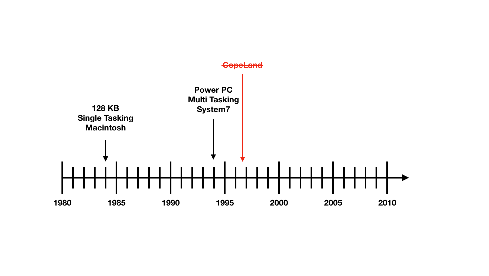

애플은 1984년 128KB 크기의 RAM, 68KB 크기의 CPU를 가지고, 싱글태스킹(Single Tasking)을 지원하는 매킨토시를 출시했다.

이후, 10년 후에 멀티태스킹(Multi Tasking)을 지원하는 System7 운영체제를 기반으로 하는 PowerPC를 출시했다. 하지만, 출시한 PowerPC는 멀티태스킹이 가능하긴 했지만 구조적 관점에서 메모리 보호와 큰 크기의 코드로 실행된다는 문제점이 존재했다.

당시에 이런 이유로 System7은 Window95를 전혀 따라가지 못했고, 같은 해에 애플은 Microsoft에서 NT를 개발했던 것처럼 새로운 운영체제를 개발하기로 결정했다. 개발 과정에서 이전의 운영체제와 동일한 API를 사용하여 기본에 사용하는 애플리케이션이 수정 없이 사용 가능하도록 했다. 이 프로젝트를 CopeLand라고 했으며, 프로젝트 진행에 어려움을 겪으며 결국 1996년에 취소되었다.

이후에 애플은 개발을 취소하고 새로운 운영체제 시스템을 구매하기로 결정한다. 그 당시 2가지의 운영체제를 고려하고 있었는데, 하나는 Steve Jobs가 1985년 애플을 떠나면서 설립한 NEXT STEP의 운영체제였다. 두번째는 BeOS였다. BeOS는 매킨토시 개발을 총괄하던 Gassee가 1991년 애플을 떠나면서 만든 운영체제이다. 애플은 초기에 BeOS를 구매하려고 했으나, 최종적으로 NEXT STEP의 운영체제를 구매하게 되면서 스티브잡스가 애플의 새로운 CEO가 되는 계기가 되었다.

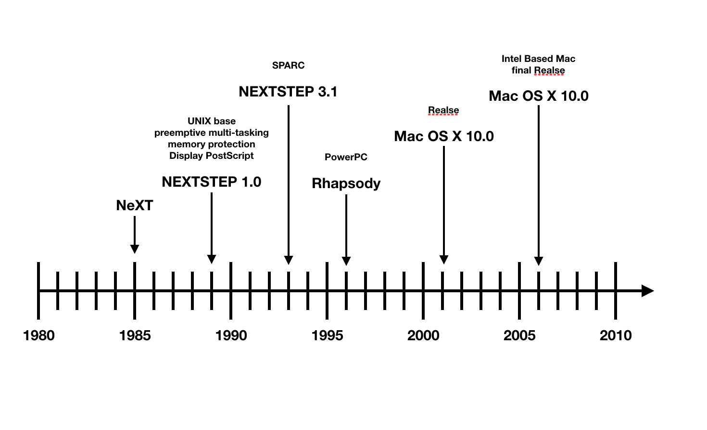

1985년 NeXT가 처음으로 개발되고, 나아가 1989년에는 NEXTSTEP 1.0이 개발되었다. NeXT 운영체제는 UNIX기반으로 선점형 멀티태스킹(Preemptive Multitasking), 메모리보호(Memory Protection), GUI기반의 디스플레이를 가지는 시스템이다.

1993년 i386 CPU와 SPARC의 아키텍처를 이용한 NEXTSTEP 3.1이 출시되면서 주목을 받았다.

1996년 NEXT STEP과 애플이 합쳐지면서 Rhapsody라는 이름의 PowerPC를 출시했다. 기존에 Mac OS의 핵심 기술인 파일시스템(Finder), 퀵타임(QuickTime), 툴박스(ToolBox), GUI, 아이튠즈(iTunes)가 추가되었고, 예전 Mac OS의 애플리케이션을 새로운 운영체제에서 사용하기 위한 클래식(Classic)이라고 불리는 가상머신(VMware)을 추가하였다.

2001년 애플은 이전의 경험을 바탕으로 초기의 Mac OS 10을 출시했다.

2005년 애플이 인텔 기반의 mac이 재출시되었고, 2006년 Mac OSX 최종버전이 출시되었다.

 

# XNU

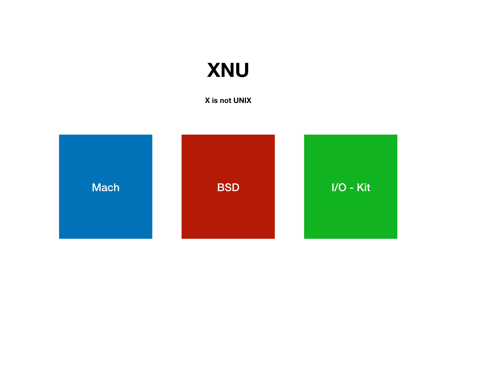

XNU의 특징
* XNU는 OSX의 핵심 커널이다. 
* OSX의 UNIX기반의 운영체제이다.
* XNU는 크게 3가지 요소(Mach, BSD, I/O-Kit)로 구성되어있다.

 

# Monolithic Kernel

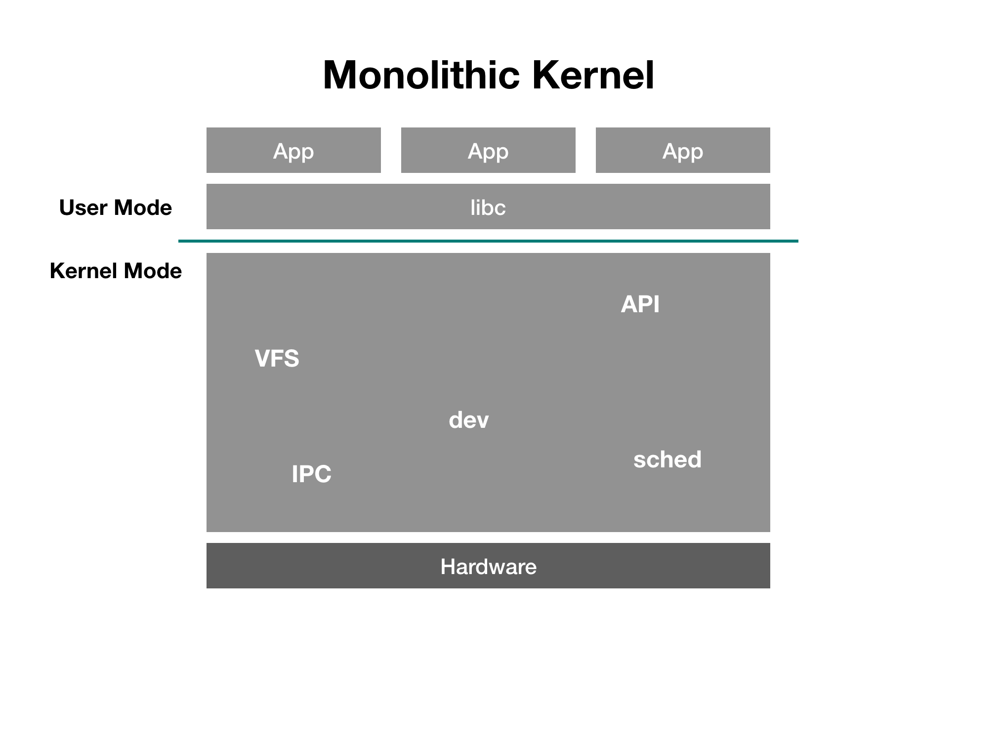

## 모놀리딕 커널(Monolithic Kernel)의 특징
* UNIX(BSD), Linux 와 같은 운영체제가 사용하는 커널이다.
* 컴포던트(파일시스템, 프레임워크, 보안요소, 유저모드 인터페이스, 네트워크, 디바이스 드라이버)가 커널모드에서 실행된다.
* 시스템콜(System call)을 사용하여 커뮤니케이션을 실행

 

## 모놀리딕 커널(Monolithic Kernel) 장점/단점
<장점>
* 각 컴포넌트(Component) 사이의 커뮤니케이션이 효율적이다.

<단점>
* 디바이스 드라이버와 같이 컴포넌트(Component)를 추가/삭제 하려면 커널을 재빌드 해야 한다. 
* 하나의 컴포넌트가(Component)가 정지하면 전체 시스템 멈춘다.

 

## 모놀리딕 커널(Monolithic Kernel) 호출 구조

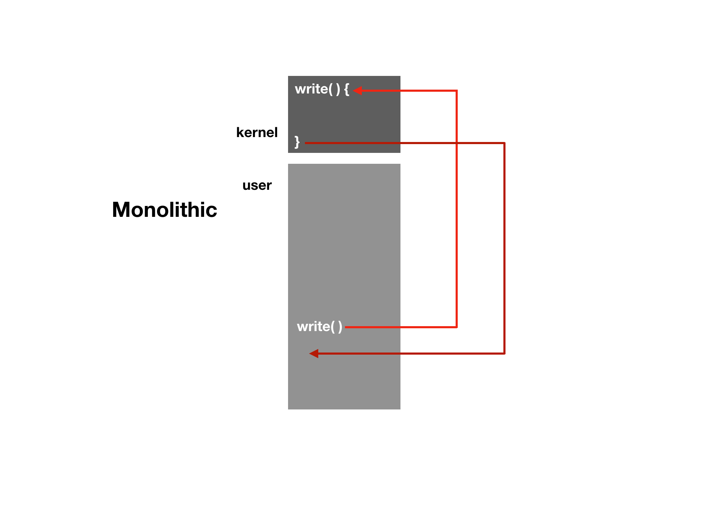

<실행 순서> 
[1] User에서 write() 함수를 실행 
[2] User의 write() 함수는 Kernel의 write() 함수를 호출(시스템 콜을 사용) 
[3] Kernel의 write() 함수가 종료되면서 결과를 User로 반환 

 

# Micro Kernel

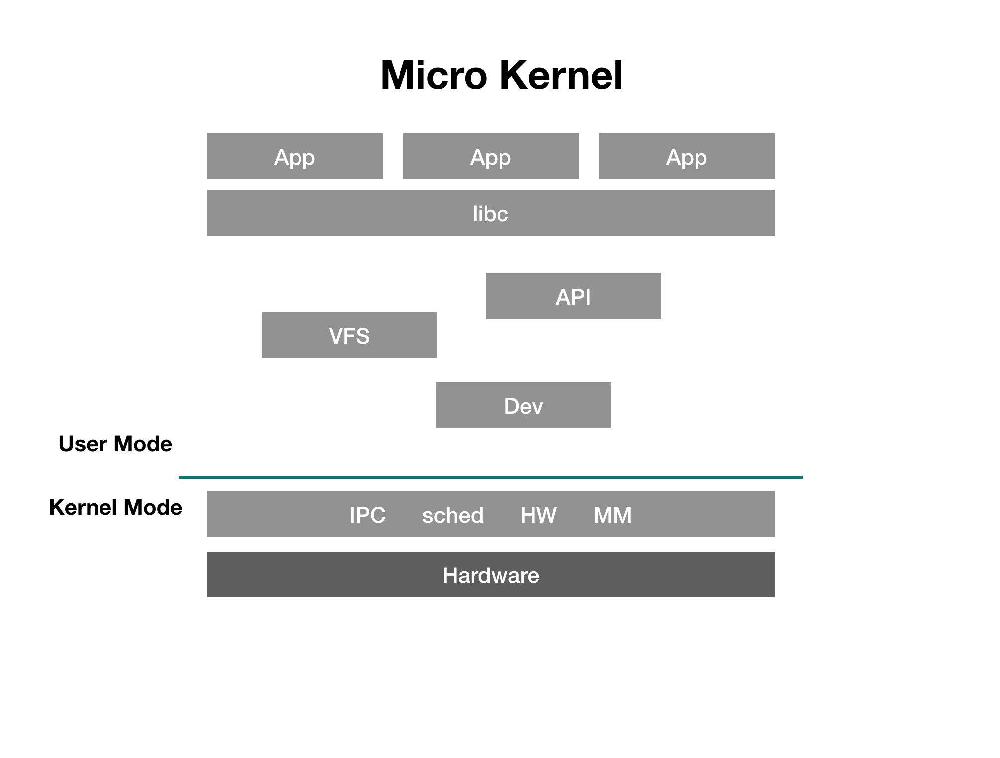

## 마이크로 커널(Micro Kernel)의 특징
* 모놀리딕 커널(Monolithic Kerenl)보다 아래단계에서 실행된다.
* 스케줄러, 메모리 메니저, 프로세서 간 통신, low-level 하드웨어와 같은 꼭 필요한 부분만 커널에서 다룬다.
* 파일시스템과 네트워크와 같은 컴포넌트(Compnent)는 사용자모드(User Mode)의 각각의 주소공간에서 구현된다.

 

## 마이크로 커널(Micro Kernel) 장점/단점
<장점>
* 컴포넌트(Component)가 분리되어 있어 드라이버, 파일시스템, 네트워크 프로토콜과 같은 컴포넌트(Component)의 충돌에도 전체 시스템이 정지하지 않는다.
* 해당 컴포던트(Component)를 재시작하여 간단하게 문제 해결이 가능하다.
* 보안 요소의 취약점에서도 유사한 장점이 적용된다. 네트워크 드라이버에서 악성코드가 실행된다고 시스템을 완전히 통제할 수 없다.
* IPC 메시지를 전송하여 커뮤니케이션을 실행

<단점>
* 시스템 기능을 하는 컴포넌트(Compent)가 각각의 서버 형태로 존재하기 때문에 많은 메시지 전송과 Context Switching이 발생하여 커뮤니케이션에 오버헤드가 발생한다.

 

# BSD Single Server

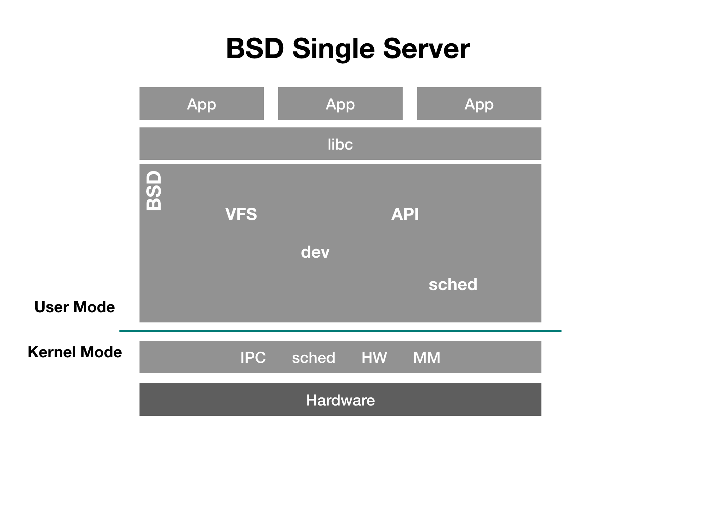

## BSD Single Server의 특징
* 마이크로 커널(Micro Kernel)에 BSD 아키텍쳐를 적용
* 기존의 마이크로 커널에서 유저모드(User Mode)에 존재하는 컴포넌트를 BSD 형태의 하나의 서버로 구성

 

## 마이크로 커널(Micro Kernel) 호출 구조

<실행 순서>

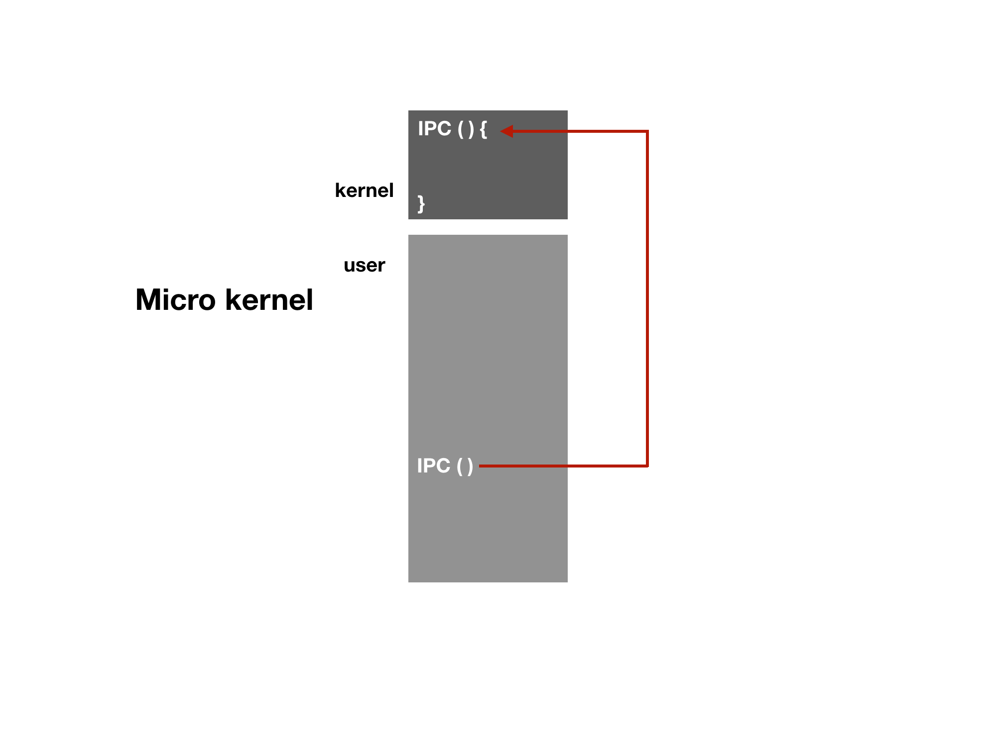

[1] User에서 Kernel로 IPC 메시지를 전달

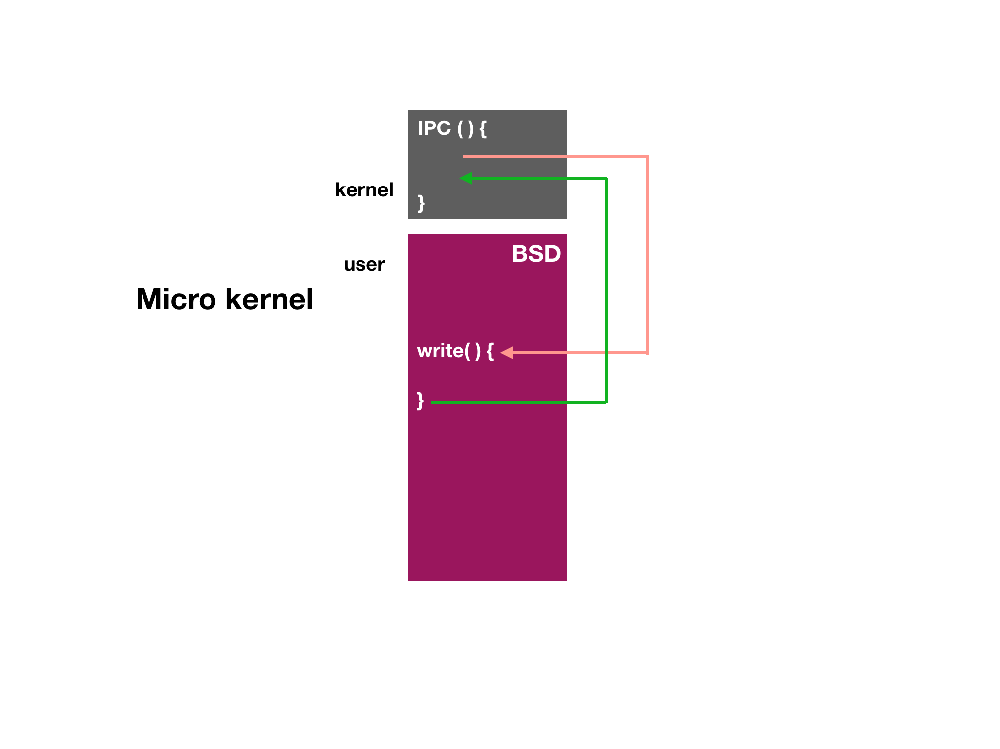

[2] Kernel은 User영역을 BSD로 전환 
[3] Kernel에서 BSD로 전환된 User영역에 IPC(___write()___ 함수 실행) 메시지 전달 
[4] User영역의 BSD에서 write() 함수를 실행하고 결과를 Kernel로 반환 

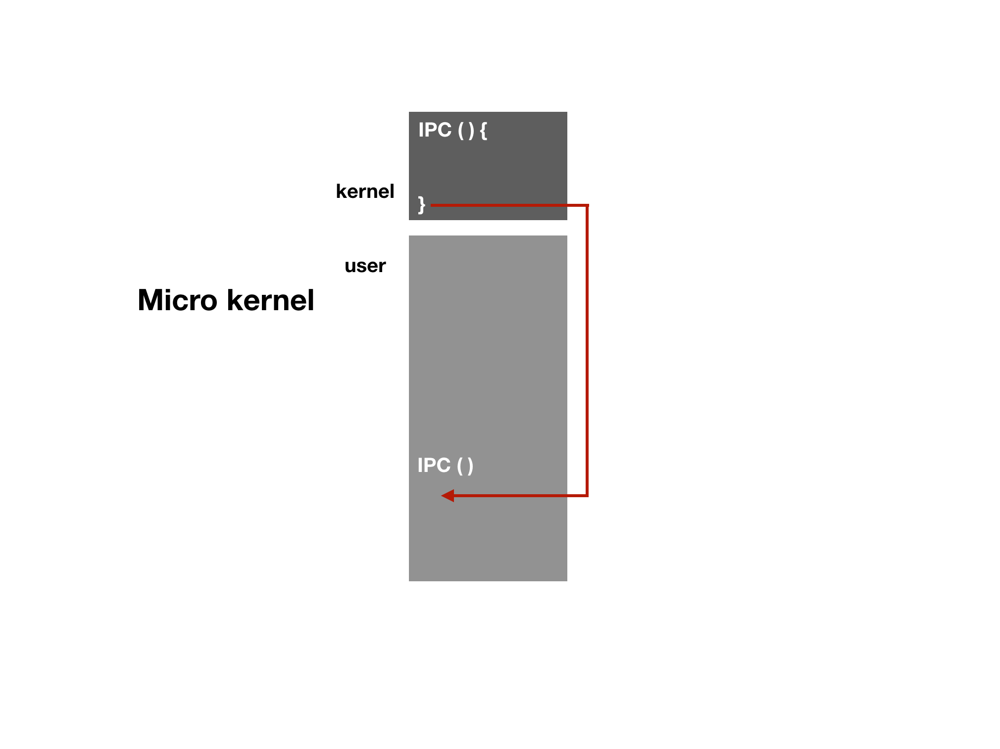

[5] Kernel은 User에서 반환 받은 결과와 함께 IPC 메시지 종료 
[6] Kernel은 User영역을 BSD에서 원래 상태로 되돌린다 
[7] Kernel은 종료된 IPC 메시지를 User에게 반환 

 

# Co-location

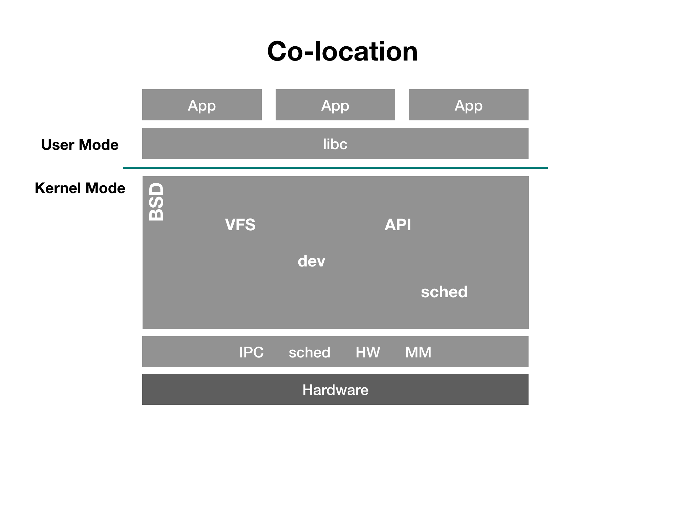

위의 마이크로 커널(Micro Kernel) 구조는 주소를 스위치하는 과정에서 TLB가 다시 채워지기까지 성능 저하로 이어진다. 따라서 OSX는 이런 성능 저하로 인해 Mach과 BSD 모두 커널(Kernel)에서 실행되는 구조로 설계되었다.

*TBL(Translation Lookaside Buffer) : 가상주소 공간과 물리 메모리 주소를 매핑하는 역할을 한다. 가상메모리와 실제 메모리를 매핑한 결과를 표시해 놓은 테이블이다.

 

# Mach

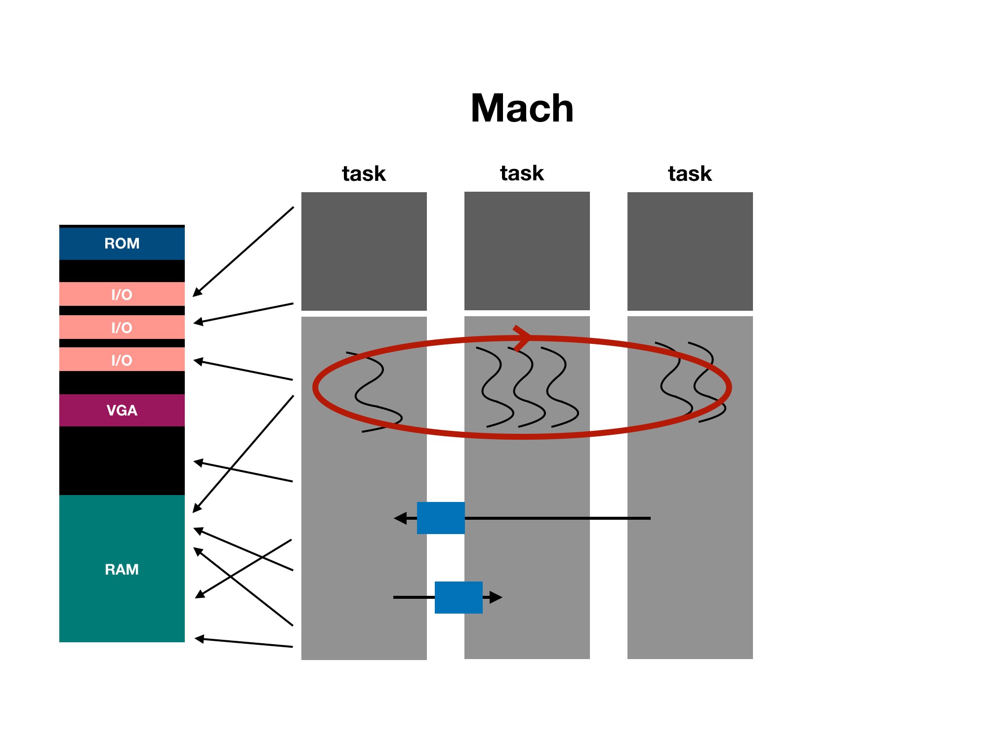

## Mach의 특징
* Mach은 가상 주소 공간과 물리 주소 공간을 관리하고 매핑한다.
* 외부 공간을 Task라고 하고 Mach은 메모리 관리를 한다.
* Task는 페이지(Page)로 구성된다. 페이지에는 사용자(User)의 ID, 작업 디렉터리, 명령(Command Line), 관련 터미널(Terminal)과 같은 요소가 저장된다.
(페이지에는 UNIX의 PS 명령어로 얻을 수 있는 요소가 저장된다.)
* Task에는 하나 이상의 스레드가 존재하고 Mach은 이런 스레드의 스케줄링을 한다.
* Mach은 IPC를 이용해서 Task 간의 메시지를 보낼 수 있다.

 

# Mach IPC

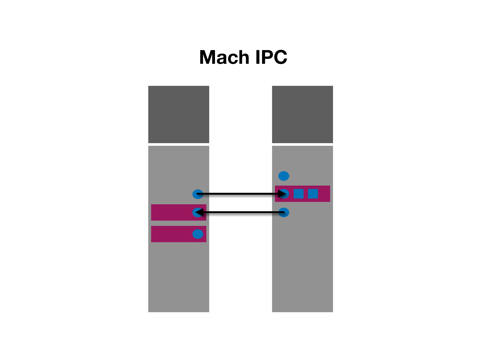

## Mach IPC의 특징
* Mach은 임의의 개수의 IPC를 가질 수 있고 송신(send)과 수신(recieve)을 하는 포트(port)가 있다.
* Mach은 메시지(Message)를 동시에(synchronously)으로 받을 수 있다.
* 메시지를 동시에 처리하는 과정에서 Mach 커널은 큐(Queue)형태의 버퍼에 메시지를 넣는다.
* 커널의 버퍼에서 메시지를 수신할 때, 가장 오래된 메시지부터 처리한다.
* 마이크로 커널(Micro Kernel)의 IPC는 일반적으로 RPC(Remote Procedure Call)라는 원격 프로시저를 호출한다.
(예를 들어, RPC는 애플리케이션에서 BSD Server를 호출하는 것이 있다.)
* IPC나 RPC를 사용하는 것은 복잡하기 때문에, 이를 간소화한 MIG(Mach Interface generator)을 사용한다.

 

~~~
[추가설명]

IPC : IPC는 각 프로세스들이 통신하는 모든 형태를 일컫는 용어이다. 다양한 형태의 메시지 전달 방식, 공유 자원에 접근했을 때 안전을 보장하는 오브젝트 동기화(Mutex)와 리소스 공유 방식(Shared Memory)이 포함된다.
RPC : RPC는 IPC의 방식 중 한 가지를 가르키는 용어이다. 이는 프로시저(메서드) 호출 내부 간의 내부 통신을 숨겨준다.
~~~

 

# Mach Interface Generator

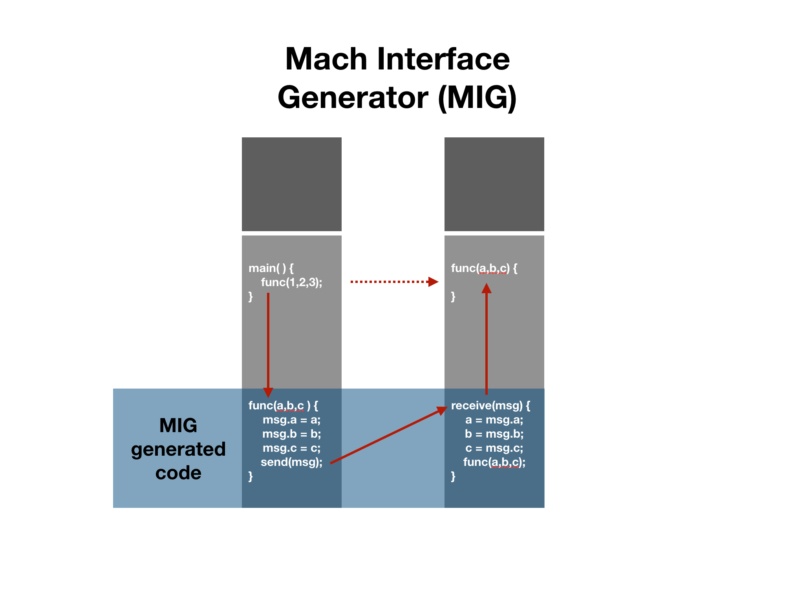

## MIG(Mach Interface Generator) 설명

MIG(Mach Interface Generator)은 RPC를 간단히한 것이다. 예를 들어, 그림의 왼쪽 Task의 main() 함수가 오른쪽 Task에 있는 func() 함수를 실행하는 방법이다. 겉으로 보기에는 빨간 점선의 화살표처럼 간단히 호출하는 것 같지만, 실제로는 복잡한 과정이 필요하다.

그림의 왼쪽 Task에서 전달인자(argument)를 오른쪽 Task로 메시지를 통해 전송한다. 오른쪽 Task는 메시지를 수신하여 전달인자(argument)를 받고 코드를 해석하여 지역함수인 func()를 실행하게 된다. 이런 과정을 통해 왼쪽 Task에서 오른쪽 Task의 func()를 호출한 것처럼 보이게 한다.

 

# Mach + BSD

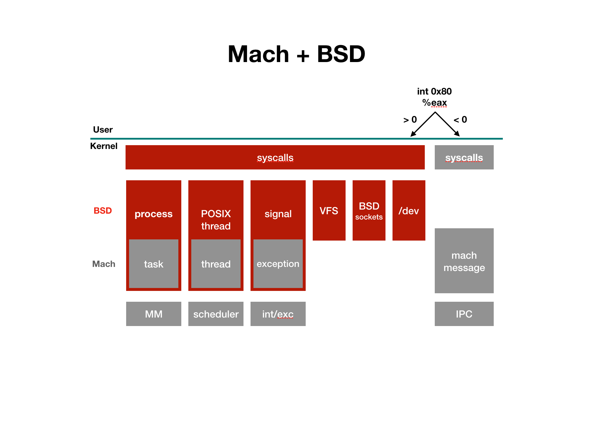

OSX의 커널은 UNIX 기반이지만 마이크로 커널인 Mach과 BSD가 합쳐진 하이브리드 커널 형태이다.

## Mach + BSD 커널(Kernel)의 구조
* Mach은 Memory manager, scheduler, 인터럽트 핸들러와 같은 low-level 하드웨어 관리와 같은 컴포넌트(Component)로 구성되어 있다.
* Mach의 컴포넌트(Component)는 Mach의 Task, Thread, exception, 메시지 개념을 사용한다.
* BSD는 Mach의 Task, Thread, exception 개념 바로 위에 놓여진다.
* Mach의 Task는 BSD의 프로세스(Process)로 확장된다.(Command Line을 통해 Context를 추가하는 방식)
* Mach의 Thread는 BSD의 POSIX thread로 확장된다.
* Mach의 Exception은 BSD의 signal로 변환된다.
* 이외의 BSD의 컴포넌트(BSD sockets, /dev, File System)는 Syscall 인터페이스를 통해 사용된다.
* Mach의 Message API는 유저(user)에 의해 간접적으로 사용된다.
* Mach, BSD에서 사용하는 2가지 형태의 syscall 인터페이스가 존재한다.

 

## 시스템 콜 (System Call, syscall)
* syscall(시스템 콜) 핸들러는 syscall(시스템 콜) 숫자를 보고 구분한다.
* 양수(>0)는 BSD syscall(시스템 콜)을 호출한다.
* 음수(<0)의 syscall(시스템 콜)은 Mach의 API를 호출한다.
* 애플은 안정적인 syscall(시스템 콜) 인터페이스를 보장하지 않기 때문에, syscall(시스템 콜)은 직접적으로 실행되지 않고 libc 라이브러리를 거쳐 실행된다.
* 이런 이유로 바이너리에는 libc를 복사한 형태인 실행파일을 담고 있기 때문에, OSX는 정적 바이너리를 사용하지 않는다.

 

--- 여기까지 완료 --- 
# Driver
추후 업데이트