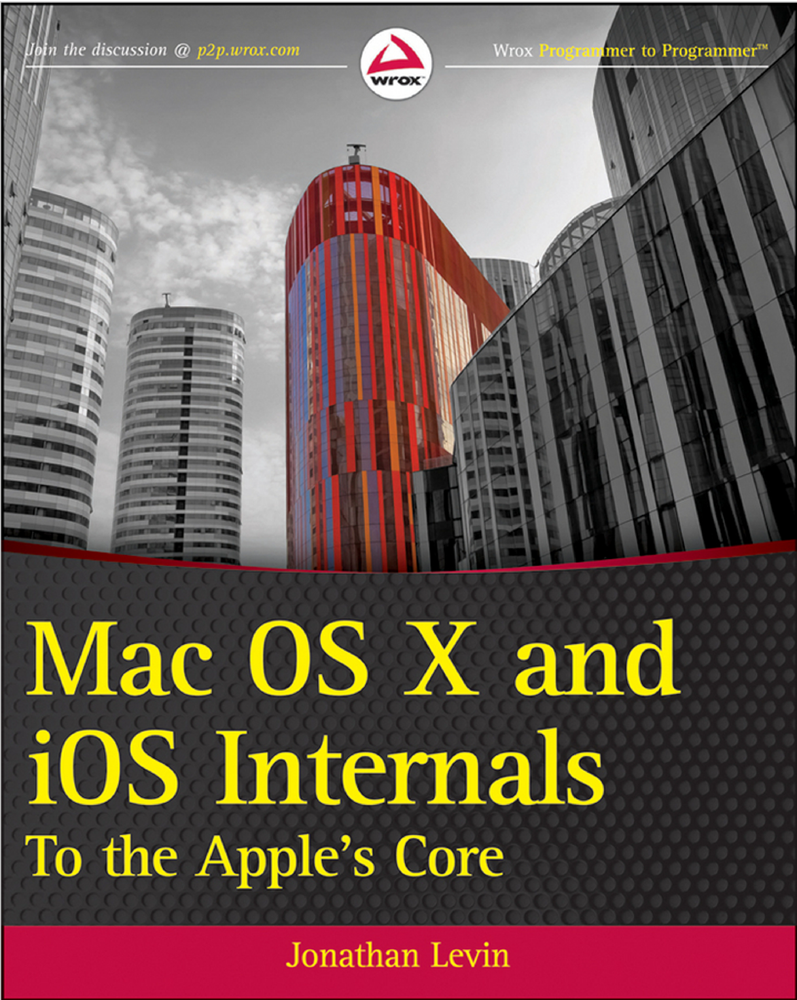
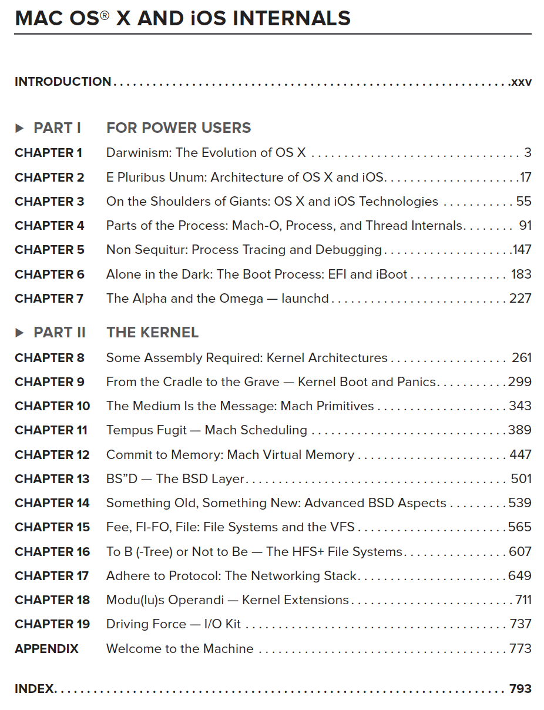

# Mac OS X Study

Mac OS X의 Kernel Extension(Kext) 및 System Extension 개발을 위해 학습한 것을 정리한 Repogitory 입니다. 주로 Mac & IOS Internals PDF를 이용하여 학습을 진행하고 부족한 부분은 Github 및 [Apple Developer](https://developer.apple.com/library/archive/documentation/Darwin/Conceptual/KernelProgramming/Extend/Extend.html) Document를 참고했습니다.

## Mac OS X 개념 정리

Mac OS X의 기본 구조를 공부하기 위해 [Youtube의 세미나](https://www.youtube.com/watch?v=-7GMHB3Plc8)를 참고하였습니다.

다음은 참고한 Youtube 세미나 내용을 정리한 문서([Mac OS X](./OSXSeminar.md))입니다.

## Mac OS X Internals

- Mac and iOS Internals

{: width="300" height="auto"}

- Study 진행 목차

{: width="500"}

- Study 내용

[Mac and iOS Internals 학습 내용 보기](./OSXInternals.md)

## System Extension

[Apple 공식 문서](https://developer.apple.com/kr/system-extensions/)

<참고 내용>
- DriverKit
- Network Extensions
- Endpoint Security

